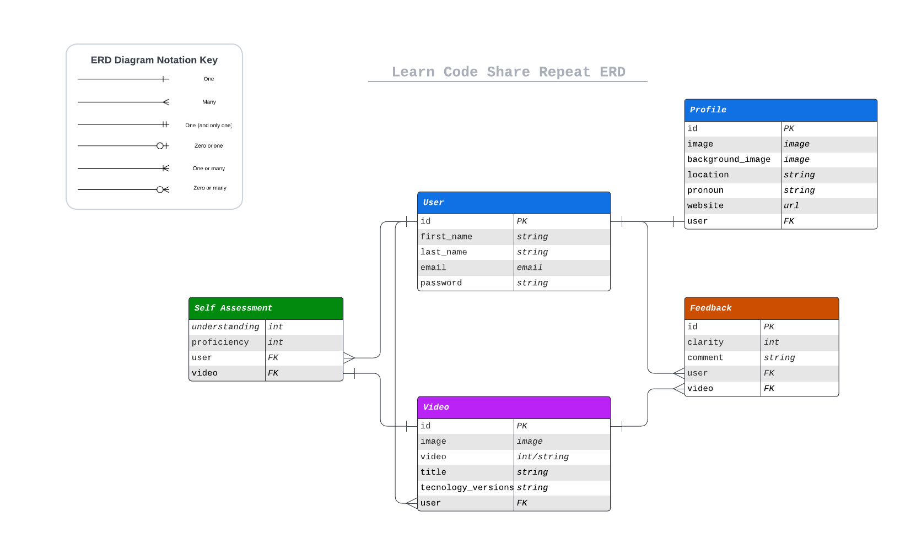

<h1>Learn Code Share Repeat</h1> 

_I aim to address the existing limitations in online video-sharing platforms where educational content
related to programming and coding becomes outdated, irrelevant, and plagued by non-constructive comments._

_I want to develop a solution that empowers coders to share their knowledge through video content in a way that ensures
the content remains up-to-date, well-explained, and transparent and fosters constructive interactions among users._

_The goal is to create an innovative web application that serves as a tool to enhance knowledge and understanding,
taking inspiration from the Richard Feynman technique, where the quality of content is paramount, and the community of
learners and experts collaborates to enhance the learning experience._

<!-- TOC -->
  * [UX/UI](#uxui)
  * [Agile](#agile)
    * [Future Implementations](#future-implementations)
  * [Schema](#schema)
  * [API](#api)
  * [Deployment](#deployment)
    * [Local](#local)
  * [References](#references)
    * [Inspiration](#inspiration)
    * [Design](#design)
      * [References | Images](#references--images)
      * [References | Videos](#references--videos)
    * [Django](#django)
    * [React](#react)
      * [Packages / Libraries](#packages--libraries)
    * [Docker](#docker)
    * [GraphQL](#graphql)
    * [Progressive Web App (PWA)](#progressive-web-app-pwa)
    * [Additional](#additional)
      * [Newsletter Emails](#newsletter-emails)
<!-- TOC -->

## UX/UI

For further details see the following documentation:

* [Define and Ideate](docs/design/define_and_ideate.md)
* [Five Planes of Design](docs/design/five-planes.md)

## Agile


### Future Implementations

* Search and Discover: Improve search and discovery functionalities, allowing users to find videos by title, tags, and
  content type.
* Content Moderation: Strengthen content moderation to maintain a positive and safe user experience.
* Open-Source Components: Explore integrating open-source components for video hosting, content management, and other
  system-level improvements to enhance efficiency and stability.
* Generative AI: Introduce generative AI for advanced content recommendation, summarisation, and user engagement
  insights.
* Micro-Learning Modules: Introduce micro-learning modules alongside video uploads, where users can engage with short,
  interactive coding challenges or quizzes related to the video content.
* Interactive Coding Environment: Offer an in-browser coding environment that allows users to practice coding while
  watching tutorial videos.
* Real-Time Coding Collaboration: Enable real-time coding collaboration between users, where they can work on coding
  projects together.
* AI-Driven Video Analytics: Implement AI-driven video analytics to track user interactions within videos.
* Live Streaming Workshops: Introduce live streaming workshops and webinars where coding experts can provide real-time
  instruction.
* Personalised Learning Paths: Develop an AI-based recommendation system that offers personalised learning paths for
  users.
* Virtual Coding Mentor: Implement a virtual coding mentor powered by AI, which can provide personalised feedback and
  guidance based on a user’s coding activity and progress.
* AI-Enhanced Collaboration: Use AI to enhance real-time coding collaboration. It can suggest solutions, identify
  errors, and provide real-time code analysis.
* Gamification and Tournaments: Introduce gamification elements and coding tournaments where users can compete and earn
  badges or rewards for achieving coding milestones.
* Multilingual Learning: Expand the platform to support multiple languages, making coding education accessible globally.
* Blockchain-Based Credentials: Explore blockchain technology to issue verifiable certificates or credentials for
  completed courses and coding challenges.

## Schema



## API

For further details see the following documentation:

* [API Overview](docs/api/api.md)

## Deployment

### Local

1. Ensure the following is installed on your machine:

    * [Docker](https://docs.docker.com/get-docker/)
    * [Docker Compose](https://docs.docker.com/compose/install/)
    * [Python 3](https://www.python.org/downloads/)
    * [Node.js](https://nodejs.org/en/download/)
    * [Yarn](https://classic.yarnpkg.com/en/docs/install/#mac-stable)

2. Create `.env` file and add environment variables:

    ```bash
    cd backend
    mv .env.sample .env
    ```

    * Add the following environment variables to the `.env` file:

        ```bash
        SECRET_KEY=your_secret_key
        DEBUG=True
        DJANGO_ALLOWED_HOSTS=localhost,
        DATABASE_URL=postgres://postgres:postgres@db:5432/postgres
        
        PIXABAY_API_KEY=https://pixabay.com/api/docs/
        PIXABAY_API_URL=https://pixabay.com/api/
        
        CLOUDINARY_URL=https://cloudinary.com/documentation/image_upload_api_reference
        CLOUDINARY_NAME=your_cloudinary_name
        CLOUDINARY_API_KEY=your_cloudinary_api_key
        CLOUDINARY_SECRET=your_cloudinary_secret
      
        EMAIL_HOST=smtp.sendgrid.net
        SENDGRID_API=your_sendgrid_api_key
        SENDGRID_FROM_EMAIL=your_sendgrid_from_email
      
        EMAIL_HOST_USER=apikey
        EMAIL_HOST_PASSWORD=your_sendgrid_api_key
        EMAIL_PORT=587
        EMAIL_USE_TLS=True
      
        SQL_ENGINE=django.db.backends.postgresql
        SQL_DATABASE=postgres
        SQL_USER=postgres
        SQL_PASSWORD=postgres
        SQL_HOST=db
        SQL_PORT=5432
        ```

3. Clone the repository:

    ```bash
    git clone https://github.com/halfpintutopia/learn-code-share-repeat.git
    ```
   
4. Create a virtual environment:

    ```bash
    python3 -m venv venv
    ```

5. Activate the virtual environment:

    ```bash
    source venv/bin/activate
    ```

6. Start backend server:

    ```bash
    cd backend
    docker compose up -d --build
    docker compose exec video-sharing python manage.py migrate
    docker compose docker compose exec video-sharing python manage.py createsuperuser
    ```
   
7. Open the browser and navigate to `http://localhost:8000/admin`.
   
8. Start frontend server:

    ```bash
    cd ../frontend
    yarn install
    yarn dev
    ```
   
9. Open the browser and navigate to `http://localhost:3001`.


## References

### Inspiration

- [How to Learn Anything with the Feynman Technique](https://todoist.com/inspiration/feynman-technique)
- [The Feynman Technique Can Help You Remember Everything You Read](https://learntrepreneurs.com/how-to-improve-the-way-you-learn/the-feynman-technique-can-help-you-remember-everything-you-read-2/)
- [The Feynman Technique | YouTube](https://www.youtube.com/watch?v=tkm0TNFzIeg)
- [Building in brighton covered in graffiti](https://www.alamy.com/stock-photo-building-in-brighton-covered-in-graffiti-23416737.html)
- [YouTube](https://www.youtube.com/)
- [FrontendMasters](https://frontendmasters.com/)
- [Vimeo](https://vimeo.com/)

### Design

- [Adobe Color](https://color.adobe.com)

#### References | Images

- [Computer Program Language Text | Photo by Jorge Jesus](https://www.pexels.com/photo/computer-program-language-text-614117/)

#### References | Videos

- [Digital Presentation Of information On A Screen Monitor | Video by Pressmaster](https://www.pexels.com/video/digital-presentation-of-information-on-a-screen-monitor-3130182/)
- [Person Encoding in a Computer | Video by Nino Souza](https://www.pexels.com/video/person-encoding-in-a-computer-2278095/)

### Django

- [Django Authentication Tutorial | Auth0](https://auth0.com/blog/django-authentication/)
- [Django | Auth0](https://auth0.com/docs/quickstart/webapp/django/01-login)
- [Secure Your Django web apps with Auth0](https://www.linkedin.com/pulse/secure-your-django-web-apps-auth0-sanchit-khurana/)
- [Tutorial | Django Girl](https://tutorial.djangogirls.org)
- [Adding Social Authentication to Django](https://testdriven.io/blog/django-social-auth/)
- [Simple JWT](https://django-rest-framework-simplejwt.readthedocs.io/en/latest/getting_started.html)

### React

- [Complete Intro to React, v8](https://frontendmasters.com/courses/complete-react-v8/)
- [Separation of Concerns in React - How to Use Container and Presentaional Components](https://www.freecodecamp.org/news/separation-of-concerns-react-container-and-presentational-components/)
- [Creating a Single-Page App (SPA) in React using React Router](https://medium.com/@diegogauna.developer/creating-a-single-page-app-spa-in-react-using-react-router-db37b89b3f73)
- [React Router 6: Authentication](https://www.robinwieruch.de/react-router-authentication/)

#### Packages / Libraries

- [React Query - Tanstack Query v5](https://www.npmjs.com/package/@tanstack/react-query)
- [Vite](https://vitejs.dev/)
- [Prettier](https://prettier.io/)
- [React | Adding a Sass Stylesheet](https://create-react-app.dev/docs/adding-a-sass-stylesheet/)
- [Bootstrap RFS (Standalone)](https://github.com/twbs/rfs/tree/v9.0.3#installation)
- [React Router](https://reactrouter.com)
- [How to Use React Helmut - With Example Use Case](https://www.freecodecamp.org/news/react-helmet-examples/)

### Docker

- [How to dockerize a Django and React application](https://www.honeybadger.io/blog/docker-django-react/)
- [React + Django + Postgres](https://forums.docker.com/t/react-django-postgres/136637)

### GraphQL

- [Code using GraphQL](https://graphql.org/code/)
- [GraphQL in Django Backend (Graphene) - React Tutorial 63](https://www.youtube.com/watch?v=zzUcL7sOQEM)
- [Django + GraphQL + React —1. Integrate GraphQL into your Django project](https://zoejoyuliao.medium.com/django-graphql-react-1-integrate-graphql-into-your-django-project-ff51237bb5d9)
- [Django + GraphQL + React —2. Integrate GraphQL into your Django project](https://zoejoyuliao.medium.com/django-graphql-react-2-integrate-graphql-into-your-react-project-71fa74f1cb00)

### Progressive Web App (PWA)

- [Make PWA of a Django Project](https://www.geeksforgeeks.org/make-pwa-of-a-django-project/)

### Additional

- [Cloud Covert | MP4 to WEBM Converter](https://cloudconvert.com/mp4-to-webm)
- [Self-hosting fonts explained (including Google fonts) // @font-face tutorial](https://www.youtube.com/watch?v=zK-yy6C2Nck)
    - GDR compliant
- [How to Use Sass and Styled Components in a React JS Application | Tim Smith](https://www.iamtimsmith.com/blog/how-to-use-styles-in-a-react-js-application)
- [react-fontawesome not displaying icons | StackOverflow](https://stackoverflow.com/a/69123598/8614652)
- [Beautiful CSS box-shadow examples](https://getcssscan.com/css-box-shadow-examples)
- [Creating a reusable pop-up modal in React from scratch](https://blog.logrocket.com/creating-reusable-pop-up-modal-react/)
- [Create Accessible Tabs with HTML, CSS & JS | Kevin Powell](https://www.youtube.com/watch?v=fI9VM5zzpu8)
  - [Heydon Works](https://heydonworks.com)
- [Free Responsive HTML Email Template](https://github.com/leemunroe/responsive-html-email-template)
- [Handling Tabs Using Page URLs and React Router Doms](https://app.pluralsight.com/guides/handling-tabs-using-page-urls-and-react-router-doms)
- [Stately](https://stately.ai)
- [X State](https://xstate.js.org)
- [You need to fix your `line-hegiht`](https://www.kevinpowell.co/article/line-height/)
- [MDN Web Docs](https://developer.mozilla.org)
- [Sendgrid](https://sendgrid.com)
- [A better image reset for your CSS](https://www.youtube.com/watch?v=345V2MU3E_w&list=PLjY7XQnia3s5x9VepvUha4v4T0wELnFmR&index=21&t=79s)
  - [The Ultimate Low-Quality Image Placeholder Technique](https://csswizardry.com/2023/09/the-ultimate-lqip-lcp-technique/)
- [How to code a carousel with HTML, CSS and JavaScript - from scratch (part 1)](https://www.youtube.com/watch?v=VYsVOamdB0g)
- [How to code a carousel with HTML, CSS and JavaScript - from scratch (part 2)](https://www.youtube.com/watch?v=gBzsE0oieio)
- [Django React Docker Heroku Template](https://github.com/Alschn/django-react-docker-heroku-template)

#### Newsletter Emails

- [Choosing a Responsive Email Framework: MJML vs Foundation for Emails](https://css-tricks.com/choosing-a-responsive-email-framework%E2%80%8Amjml-vs-foundation-for-emails/)
- [Best Free Responsive HTML Email Template Builders for 2023](https://andrewlaurentiu.medium.com/best-responsive-email-templates-builder-2018-9dedb6883783)
  - [mjml](https://mjml.io)
  - [heml](https://heml.io/)
- [Email BoilerPlate](https://github.com/seanpowell/Email-Boilerplate/blob/master/email.html)
