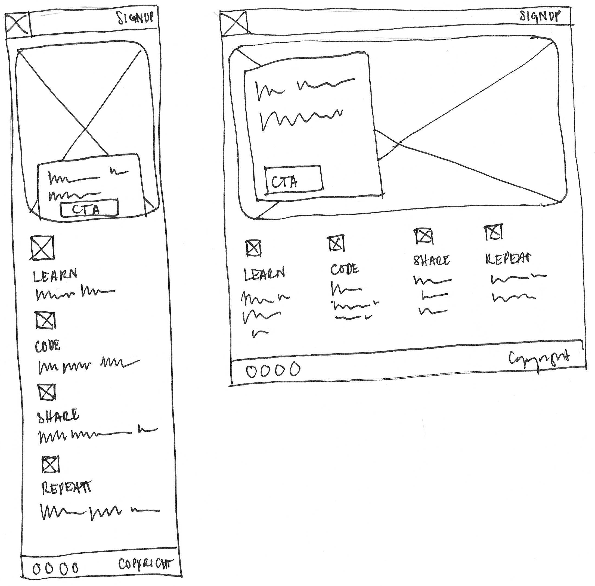
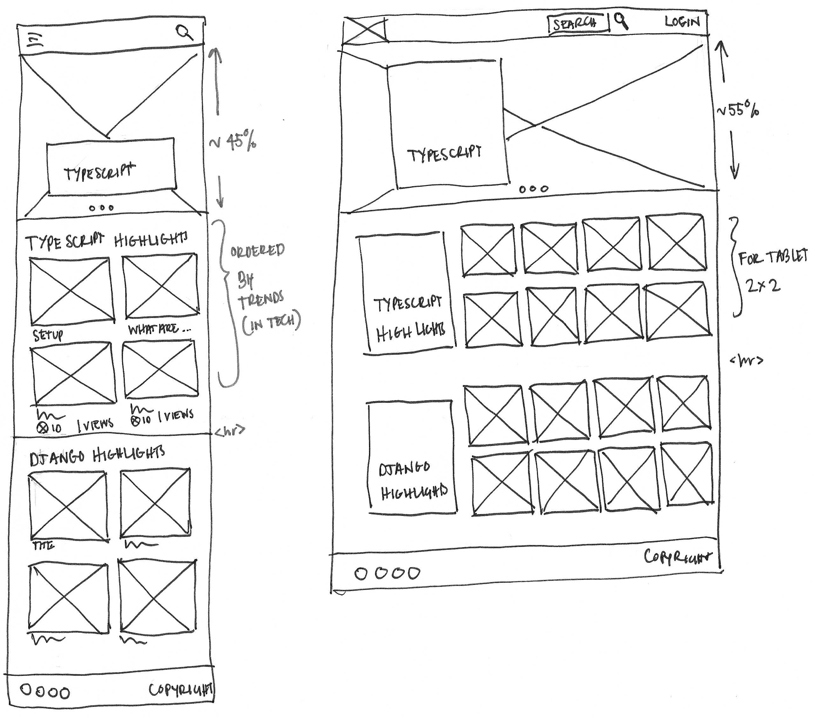
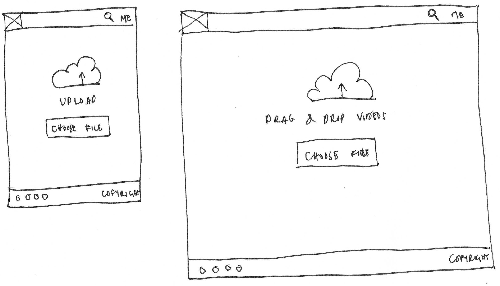
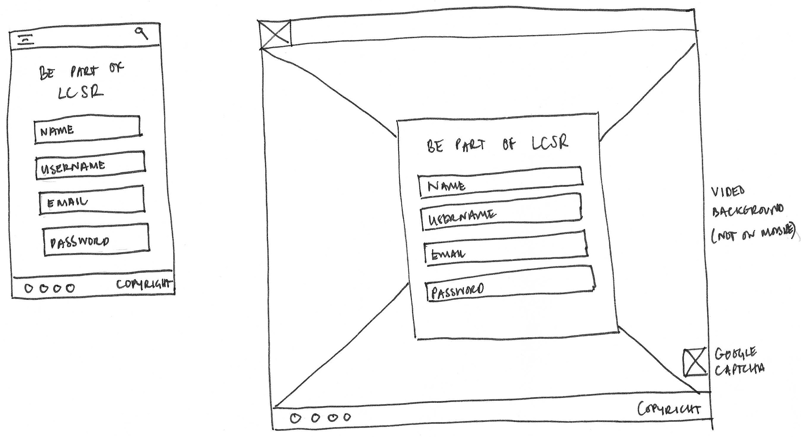
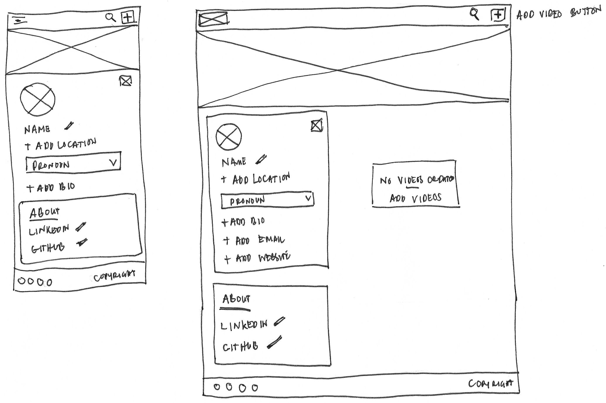
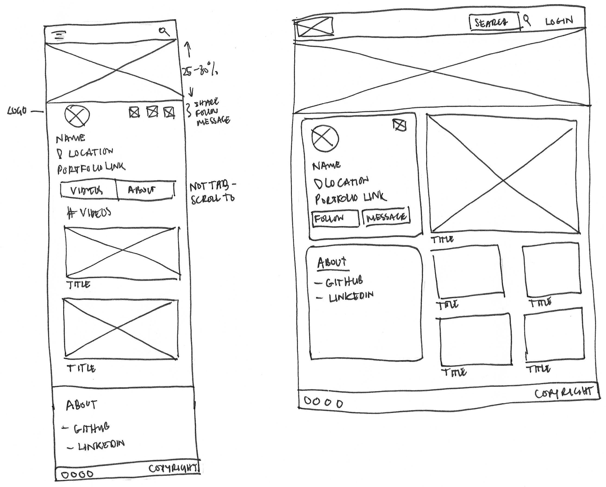

<h1>Five Planes of Design</h1>

_During the initial brainstorming phases, I used this part primarily to generate ideas and concepts. However, I refined
and defined these ideas further using matrices. This iterative approach allowed me to develop more precise and
well-structured solutions as I advanced through the design or problem-solving process._

<!-- TOC -->

* [1. Strategy Plane](#1-strategy-plane)
    * [Target Audience](#target-audience)
    * [User and Client Needs](#user-and-client-needs)
    * [Opportunity Matrices](#opportunity-matrices)
* [2. Scope Plane](#2-scope-plane)
    * [Content and Functionality Requirements](#content-and-functionality-requirements)
* [3. Structure Plane](#3-structure-plane)
* [4. Skeleton Plane](#4-skeleton-plane)
    * [Navigation Map](#navigation-map)
    * [Wireframes / Prototypes (Draft)](#wireframes--prototypes-draft)
* [References](#references)
    * [Fonts](#fonts)
    * [Images](#images)
    * [Videos](#videos)

<!-- TOC -->

## 1. Strategy Plane

### Target Audience

_Coding Enthusiasts and Learners_

Understanding the diverse roles, demographics, psychographics, and values of the target audience is essential for
tailoring my platform's content and features to meet their specific needs and preferences.

This insight will guide my content creation, user engagement strategies, and overall platform design to create a
meaningful and effective learning experience for the audience.

**Roles:**

* Novice Coders - _Individuals who are new to coding and want to learn the fundamentals._
* Intermediate Coders - _Learners with some coding experience looking to advance their skills._
* Advanced Coders - _Experienced developers seeking to stay up-to-date and share their knowledge._
* Coding Instructors - _Professionals interested in teaching and sharing coding expertise._
* Tech Career Seekers - _Individuals exploring coding as a career change or enhancement._

**Demographic:**

* Age - _Ranging from teenagers to adults._
* Gender - _Diverse, with a significant proportion of both males and females._
* Location - _Global reach, but with a concentration in tech hubs and urban areas._
* Education - _Varies from high school students to college graduates and experienced professionals._
* Employment Status - _Students, employed, and job-seekers._
* Income Levels - _Diverse, focusing on affordability for students and beginners._

**Psychographics:**

* Learning Styles - _Embrace different learning styles, including visual, auditory, and hands-on._
* Motivation - _Driven by a desire to acquire coding skills for personal growth, career advancement, or creative
  projects._
* Tech Enthusiasm - _Passion for technology and a desire to be part of the tech community._
* Community Engagement - _Willingness to engage with others, seek help, and share knowledge._
* Growth Mindset - _Open to challenges and eager to continually improve coding skills._

**Values:**

* Quality Content _Seek high-quality, up-to-date, and accurate coding tutorials._
* Community _Value a supportive and collaborative community of learners and experts._
* Simplicity _Appreciate clear, simple, and well-structured learning materials._
* Innovation _Open to new approaches in learning and teaching coding._
* Empowerment _Value the ability to gain practical coding skills and make a meaningful impact._

### User and Client Needs

Understanding these user and client needs will guide the design and development of the web application, ensuring it
offers a seamless and valuable experience for both user and client stakeholders. It also helps establish a strong
foundation for the platform's success and growth.

**User Needs:**

* Learn Coding _The website must provide an intuitive and comprehensive learning experience that allows users to
  acquire coding skills at their own pace, from novice to advanced levels._
* Access Quality Content _Ensure the platform offers high-quality, up-to-date coding tutorials, video explanations,
  and interactive challenges, enabling users to access reliable educational content._
* Engage with the Community _Foster a sense of community and learning by enabling users to engage with others through
  comments, discussions, and collaboration on coding projects._
* Track Progress _Implement user-friendly tools to allow users to track their progress, completed courses, and coding
  challenges, offering a sense of accomplishment and motivation._
* Teach and Share Knowledge _Provide tools and features that enable users to create and share their coding tutorials,
  contribute to discussions, and support other learners in the community._
* Personalise Learning _Offer personalised recommendations and learning paths based on user preferences, skill
  levels, and learning styles._
* Seek and Offer Help _Facilitate users in seeking help and getting answers to their coding questions while
  encouraging them to contribute their knowledge to help others._
* Stay Updated _Keep users informed about coding trends and industry developments, ensuring they have access to the
  latest information and technologies._
* Secure and Private Learning _Prioritise user data security and privacy, ensuring that user information is
  protected._

**Client Needs:**

* Content Management _Enable clients to easily manage and organise educational content, including videos, tutorials,
  and challenges._
* Community Building _Provide tools for clients to build and manage a vibrant user community, including user
  engagement, discussions, and feedback._
* Content Creation _Offer intuitive content creation tools for clients to develop high-quality coding tutorials and
  interactive challenges._
* User Analytics _Implement user analytics and insights to help clients understand user behaviour, preferences, and
  the effectiveness of their content._
* Monetisation Options _Enable clients to monetise their content through various means, such as ads, premium
  subscriptions, or course sales._
* Quality Control _Offer moderation and quality control features to help clients maintain the integrity and relevance
  of their content._
* Client Support _Provide client support and guidance to help them make the most of the platform and optimise their
  educational offerings._
* User Management _Enable clients to manage user accounts, profiles, and access control._
* Brand Customisation _Allow clients to customise the platform's branding to align with their identity and values._

### Opportunity Matrices

**User Needs:**

| Importance \ Viability | 0 (Low) | 1 | 2 | 3                                                                                                      | 4                                                                                                                                                                                              | 5 (High)                                         |
|------------------------|---------|---|---|--------------------------------------------------------------------------------------------------------|------------------------------------------------------------------------------------------------------------------------------------------------------------------------------------------------|--------------------------------------------------|
| 0 (Low)                |         |   |   |                                                                                                        |                                                                                                                                                                                                |                                                  |
| 1                      |         |   |   |                                                                                                        |                                                                                                                                                                                                |                                                  |
| 2                      |         |   |   |                                                                                                        |                                                                                                                                                                                                |                                                  |
| 3                      |         |   |   | * **Track Progress** (Importance: 3, Viability: 3) * **Stay Updated** (Importance: 3, Viability: 3) | * **Teach and Share Knowledge** (Importance: 4, Viability: 3) * **Seek and Offer Help** (Importance: 4, Viability: 3)                                                                       |                                                  |
| 4                      |         |   |   | * **Personalise Learning** (Importance: 3, Viability: 4)                                               | * **Access Quality Content** (Importance: 4, Viability: 4) * **Engage with the Community** (Importance: 4, Viability: 4) * **Secure and Private Learning** (Importance: 4, Viability: 4) |                                                  |
| 5 (High)               |         |   |   |                                                                                                        |                                                                                                                                                                                                | * **Learn Coding** (Importance: 5, Viability: 5) |

**Client Needs:**

| Importance \ Viability | 0 (Low) | 1 | 2 | 3                                                       | 4                                                                                                                                                                                                                                                                                      | 5 (High)                                                                                                       |
|------------------------|---------|---|---|---------------------------------------------------------|----------------------------------------------------------------------------------------------------------------------------------------------------------------------------------------------------------------------------------------------------------------------------------------|----------------------------------------------------------------------------------------------------------------|
| 0 (Low)                |         |   |   |                                                         |                                                                                                                                                                                                                                                                                        |                                                                                                                |
| 1                      |         |   |   |                                                         |                                                                                                                                                                                                                                                                                        |                                                                                                                |
| 2                      |         |   |   |                                                         |                                                                                                                                                                                                                                                                                        |                                                                                                                |
| 3                      |         |   |   | * **Brand Customisation** (Importance: 3, Viability: 3) | * **Client Support** (Importance: 4, Viability: 3)                                                                                                                                                                                                                                     |                                                                                                                |
| 4                      |         |   |   |                                                         | * **Community Building** (Importance: 4, Viability: 4) * **User Analytics** (Importance: 4, Viability: 4) * **Monetisation Options** (Importance: 4, Viability: 4) * **Quality Control** (Importance: 4, Viability: 4) * **User Management** (Importance: 4, Viability: 4) | * **Content Management** (Importance: 5, Viability: 4) * **Content Creation** (Importance: 5, Viability: 4) |
| 5 (High)               |         |   |   |                                                         |                                                                                                                                                                                                                                                                                        |                                                                                                                |

## 2. Scope Plane

| Text Color Key                                                            | Label                 |
|---------------------------------------------------------------------------|-----------------------|
| 

 | MVP                   |
| 

 | Future Implementation |

### Content and Functionality Requirements

The content and functionality requirements are essential for defining what users will find on the platform and what they
can do. They serve as a foundation for the development and design of the web application.

**Content Requirements:** 
> _The user will be looking for ..._

* Peer Created Coding Tutorials _The platform should provide various coding
  tutorials for various programming languages,
  practicing and improving on the content to make it more accurate, up-to-date, and easy to understand._
* Interactive Coding Challenges _Users should have access to interactive coding
  challenges and exercises that align with
  tutorial content, allowing them to apply what they've learned._
* User-Generated Content _Enable users to contribute their coding tutorials,
  fostering a community of knowledge sharing
  and diverse learning resources._
* Community Discussions _Facilitate discussions, forums, and Q&A sections where users can seek help, share knowledge,
  and engage in constructive conversations related to coding._
* Personalised Learning Paths _Implement a recommendation system that suggests
  learning paths based on a user's skill
  level, interests, and progress._
* Coding Projects / Opportunities _Offer real-world coding projects, assignments
  and opportunities that allow users to apply their skills and gain
  practical experience._
* Industry Updates _Keep users informed about the latest trends, tools, and
  advancements in the tech industry, ensuring
  they stay up-to-date._
* Security and Privacy _Safeguard user data and ensure a secure and private learning environment._

**Functionality Requirements:** 
> _The user will be able to ..._

* User Registration and Profiles _Users should be able to create accounts, set
  up profiles, and customise their learning
  preferences._
* Search and Navigation Search and Navigation _Implement a user-friendly
  search and navigation system that allows users to find relevant
  content easily._
* Video Player _Provide a high-quality video player with playback controls for
  an enhanced viewing experience._
* User Contributions _Enable users to upload, edit, and manage their coding tutorials and challenges._
* Community Interaction _Implement features for users to post comments, ask questions, and discuss with other
  community
  members._
* Progress Tracking _Users should be able to track their progress within
  tutorials, challenges, and projects, with clear
  indicators of completed milestones. e.g. understand 75% of the basic concept of CSS_
* Recommendation Engine _Develop a recommendation system that suggests content
  and learning paths based on user
  preferences and progress._
* User Notifications _Keep users informed about platform updates, responses to their comments, and recommended
  content._
* Feedback and Reporting _Allow users to provide feedback on content and report inappropriate or inaccurate
  material._
* Monetisation Options _For clients, provide tools to monetise content, such as
  ads, premium subscriptions, or course
  sales._
* Content Moderation _Implement moderation tools for clients to maintain content quality and relevance._
* Client Support _Offer client support features to assist clients in managing their content and using the platform
  effectively._
* User Account Management _Enable users to manage their accounts, profiles, and privacy settings._

## 3. Structure Plane

The following journey maps illustrate the steps different types of users (regular users, platform admins, and content
repository admins) would take as they interact with the web application, helping to ensure a smooth and well-structured
user experience.

**Information Architecture:**

* Home Page
    * Featured Tutorials
    * Recommended Learning Paths
    * Latest Coding Challenges
* Learning Pathways
    * Programming Languages
    * Skill Levels
* Coding Tutorials
    * Video Tutorials
    * Written Guides
    * Interactive Code Editor
* Coding Challenges
    * Filter by Difficulty
    * Search Challenges
    * Submit Solutions
* Community
    * Discussions
    * Q&A Forum
    * User-Generated Content
* User Profiles
    * Account Settings
    * Progress Tracking
    * User Contributions
* News and Updates
    * Tech Industry News
    * Platform Updates
* Search and Navigation
    * Search Bar
    * Browsing Categories
* Authentication and Security
    * User Login/Registration
    * Data Security Measures

---

* Client Dashboard (Admin)
    * Content Management
    * User Analytics
    * Quality Control

---

* Repository Dashboard (Repo Admin)
    * Content Repository
    * Moderation Tools
    * User Support

**User Journey:** 
_User Registration and Learning Path_

* The user lands on the Home Page.
* The user clicks on "Sign Up."
* The user creates an account with personal details.
* The user selects a preferred coding learning path.
* Based on the selected path, the platform presents the user with recommended coding
  tutorials.
* The user begins a coding tutorial and tracks progress.
* The user engages in discussions and asks questions on the community forum.
* The user receives recommendations for the following tutorial based on their progress.

**Admin Journey (Client Dashboard):** 

* Managing Content and Community
* Admin logs in to the Client Dashboard.
* Admin views analytics of user engagement and content performance.
* Admin uploads a new coding tutorial to the platform.
* Admin moderates and approves user-generated content.
* Admin responds to user inquiries and support requests.
* Admin reviews and removes inappropriate content.

**Repo Admin Journey (Repository Dashboard):** 

* Managing the Content Repository
* Repo Admin logs in to the Repository Dashboard.
* Repo Admin views the repository of coding tutorials and challenges.
* Repo Admin moderates and approves new content submissions.
* Repo Admin monitors content quality and relevance.
* Repo Admin provides support to content creators and users.
* Repo Admin responds to inquiries and reports related to content issues.

## 4. Skeleton Plane

| Text Color Key                                                            | Label                 |
|---------------------------------------------------------------------------|-----------------------|
| 

 | MVP                   |
| 

 | Future Implementation |

The navigation map represents the top-level sections and associated subsections. It provides a clear hierarchy of how
users navigate the web application.

The navigation map is a foundation for designing the user interface (UI) and ensuring a logical and user-friendly layout
for the platform. It helps users quickly find and access the content and features they need.

**Header Section:** 
_Header (Common to all pages)_

* Logo and Branding
* User Account Controls (e.g., Login, Profile)
* Search Bar

**Footer Section:** 
_Footer (Common to all pages)_

* Links to Important Pages (e.g., About, Contact)
* Copyright Information
* Social Media Links
* Privacy Policy and Terms of Use

### Navigation Map

Home

* Featured Tutorials
* Learning Paths

Learning Pathways

* Programming Languages
* Skill Levels

Coding Tutorials

* Video Tutorials
* Written Guides
* Interactive Code Editor

Coding Challenges

* Filter by Difficulty
* Search Challenges
* Submit Solutions

Community

* Discussions
* Q&A Forum
* User-Generated Content

User Profiles

* Account Settings
* Progress Tracking
* User Contributions

News and Updates

* Tech Industry News
* Platform Updates

Client Dashboard (Admin)

* Content Management
* User Analytics
* Quality Control

Repository Dashboard (Repo Admin)

* Content Repository/Registration
* Moderation Tools/Registration
* User Support

Authentication and Security

* User Login/Registration
* Data Security Measures

### Wireframes / Prototypes (Draft)

_These are specifically hand-drawn (sketchy) drafts of the wireframes._

**Landing Page (mobile, desktop)**

 

**Video List (mobile, desktop)**

 

**Video Upload (mobile, desktop)**

 

**Register / Login (mobile, desktop)**

 

**Account page | no content (mobile, desktop)**

 

**Account page | with content (mobile, desktop)**

## References

### Fonts

- [Variable Fonts](https://v-fonts.com/licenses/open-source)
- [Barlow](https://tribby.com/fonts/barlow/#specimen)
- [Barlow | Google Fonts](https://fonts.google.com/specimen/Barlow)

### Images

### Videos

- [Free Code Videos | Pexels](https://www.pexels.com/search/videos/code/)
- [Coverr](https://coverr.co/)
